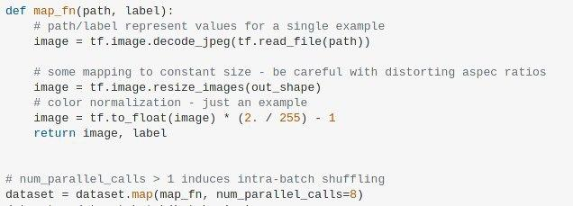

<div align="center">

# Pokémon CV Revival

</div>

<div align="center">

[![made-with-python][made-with-phyton-shield]][made-with-phyton-url]
[![made-with-Markdown][made-with-markdown-shield]][made-with-markdown-url]
[![Open Source Love png1][open-source-shield]][open-source-url]
[![GPLv3 license][license-shield]][license-url]
[![Raspberry Pi][raspberry-shield]][raspberry-url]
[![Keras][keras-shield]][keras-url]
[![TensorFlow][tensorflow-shield]][tensorflow-url]
[![Open CV][opencv-shield]][opencv-url]
[![nVIDIA][nvidia-shield]][nvidia-url]
<br/>
[![Open In Collab][open-collab-shield]][open-collab-url]
[![Downloads][downloads-shield]][downloads-url]
[![Contributors][contributors-shield]][contributors-url]
[![Forks][forks-shield]][forks-url]
[![Stargazers][stars-shield]][stars-url]
[![Issues][issues-shield]][issues-url]
</div>

Our computer vision related project for nostalgic poke weebs (Sistemi digitali, Unibo).

## Ideas
- Pokèmon image identification (from the image on the card)
- stats reading (+ calculus on the best combo (?))
- Fake, rare and printing errors recognition
- 3D model animation (associated with the recognized card)

## TO-DO list
1. Find the best cards dataset available (even with only one generation)
2. Angle straighten (upright set) and card recognition (see resources for examples)
3. Card stats reading
4. Fake card recognition
5. 3d models output of the card

## Tools
- [PyCharm](https://www.jetbrains.com/pycharm/)
- [Anaconda](https://www.anaconda.com/)
- [Sketchup browser](https://app.sketchup.com/)
<!-- - ssh(?) -->

## Resources

- Dataset pokèmon:
  - https://www.kaggle.com/thedagger/pokemon-generation-one
  - 
- pokèmon cards images archive: https://drive.google.com/file/d/1CIx33WVaqEXLqLt95nRtRskgmTTTMPpn/view
- Magic cards recognition: https://github.com/YenTheFirst/card_scan
- Pokèmon card text reading: https://stackoverflow.com/questions/62116719/read-text-on-card
- Poker playing cards recognition (on Raspberry pi3 + picamera): https://github.com/EdjeElectronics/OpenCV-Playing-Card-Detector
- Augmented reality: https://bitesofcode.wordpress.com/2017/09/12/augmented-reality-with-python-and-opencv-part-1/ & https://github.com/juangallostra/augmented-reality
- Detection Models: https://github.com/tensorflow/models/blob/master/research/object_detection/g3doc/tf1_detection_zoo.md (ssd_mobilenet are the best for devices with low computational power, e.g. raspberry)

## Step 1: Testing picamera + openCV

### Raspberry

On raspberry install the following packages:

```
sudo apt python3-pip
pip3 install opencv-python zmq imagezmq numpy imutils
```

Execute `./stream/SistemiDigitali/video_capture.py`
## Step 2: Receiving the images
The following packages must be installed:

**Compiled from scratch**
- python-opencv

**pacman/apt**
- cuda
- gcc-10

**with pip inside a conda environment**
```
conda activate cv
export READTHEDOCS=True
pip3 install zmq imagezmq imutils picamera
```

**with conda**
`conda install -c conda-forge libgcc-ng=11.1.0 libstdcxx-ng=11.1.0`

#### Arch-based distro
Install OpenCV and all the dependencies as described here https://gist.github.com/nihil21/f2ea6b6f092469ecd0bfb910301c62a2.
After that, install what is missing:
```
conda activate cv
export READTHEDOCS=True
pip3 install zmq imagezmq imutils picamera
```

Execute the following script (on pc):
`python3 ./stream/SistemiDigitali/stream_receiver.py -ip <ip_raspberry>`

## Step 3: Training
Some notes:
- `tf.data.Dataset` API.
- Loading folders of images in Tensorflow: https://stackoverflow.com/a/52417770.
- From a list of images paths, with the special function `map`, convert a image path into an image.



- The function`map_fn(path, label)` return the image uploaded and its label from a image path and its label.
- `dataset.map(map_fn)` loads an image path in a lazy way (in this way the RAM won't be saturated).


- A dataset is created from a string list, which represents every image path.
- The list is converted to a string tensor.
- A dataset object is created from this tensor:
`dataset = tf.data.Dataset.from_tensor_slices((image_paths, labels))`

## Contacts
* [TryKatChup](https://www.linkedin.com/in/karina-chichifoi/?locale=en_US)
* [Mikyll](https://www.linkedin.com/in/michele-righi/?locale=en_US)

<!-- MARKDOWN LINKS & IMAGES -->
<!-- https://www.markdownguide.org/basic-syntax/#reference-style-links -->
[ask-me-anything-shield]: https://img.shields.io/badge/Ask%20me-anything-1abc9c.svg
[ask-me-anything-url]: https://github.com/TryKatChup/pokemon-cv-revival/issues
[open-collab-shield]: https://colab.research.google.com/assets/colab-badge.svg
[open-collab-url]: https://github.com/TryKatChup/pokemon-cv-revival/issues
[made-with-phyton-shield]: https://img.shields.io/badge/Made%20with-Python-14354C.svg
[made-with-phyton-url]: https://www.python.org/
[made-with-markdown-shield]: https://img.shields.io/badge/Made%20with-Markdown-1f425f.svg
[made-with-markdown-url]: http://commonmark.org
[open-source-shield]: https://badges.frapsoft.com/os/v1/open-source.png?v=103
[open-source-url]: https://github.com/ellerbrock/open-source-badges/
[license-shield]: https://img.shields.io/badge/License-GPLv3-blue.svg
[license-url]: http://perso.crans.org/besson/LICENSE.html
[raspberry-shield]: https://img.shields.io/badge/-RaspberryPi-C51A4A?&logo=Raspberry-Pi
[raspberry-url]: https://www.raspberrypi.org/
[keras-shield]: https://img.shields.io/badge/Keras-%23D00000.svg?logo=Keras&logoColor=white
[keras-url]: https://keras.io/
[tensorflow-shield]: https://img.shields.io/badge/TensorFlow-%23FF6F00.svg?logo=TensorFlow&logoColor=white
[tensorflow-url]: https://www.tensorflow.org/
[opencv-shield]: https://img.shields.io/badge/opencv-%23white.svg?logo=opencv&logoColor=white
[opencv-url]: https://opencv.org/
[nvidia-shield]: https://img.shields.io/badge/nVIDIA-%2376B900.svg?logo=nVIDIA&logoColor=white
[nvidia-url]: https://www.nvidia.com/

[downloads-shield]: https://img.shields.io/github/downloads/TryKatChup/pokemon-cv-revival/total
[downloads-url]: https://github.com/TryKatChup/pokemon-cv-revival/releases/latest
[contributors-shield]: https://img.shields.io/github/contributors/TryKatChup/pokemon-cv-revival
[contributors-url]: https://github.com/TryKatChup/pokemon-cv-revival/graphs/contributors
[forks-shield]: https://img.shields.io/github/forks/TryKatChup/pokemon-cv-revival
[forks-url]: https://github.com/TryKatChup/pokemon-cv-revival/network/members
[stars-shield]: https://img.shields.io/github/stars/TryKatChup/pokemon-cv-revival
[stars-url]: https://github.com/TryKatChup/pokemon-cv-revival/stargazers
[issues-shield]: https://img.shields.io/github/issues/TryKatChup/pokemon-cv-revival
[issues-url]: https://github.com/mikyll/TryKatChup/pokemon-cv-revival/issues
[linkedin-shield]: https://img.shields.io/badge/-LinkedIn-black.svg?logo=linkedin&colorB=0077B5
[linkedin-url]: https://www.linkedin.com/in/michele-righi/?locale=en_US
